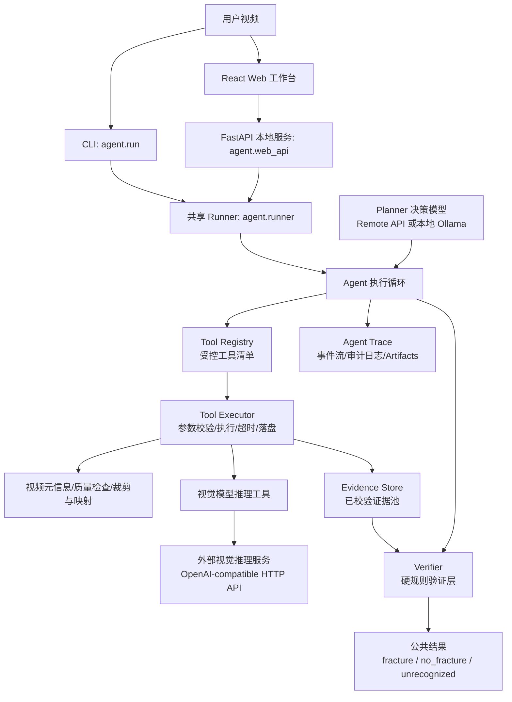

# 材料拉伸断裂识别 Agent 项目计划

> 状态：草案（待批准）
> 版本：11.0
> 适用范围：当前 TensileAgent 仓库，仅包含 Agent 端代码、配置、本地 Web 工作台和测试。

## 项目定位

TensileAgent 是材料拉伸试验视频的本地工具调用型 Agent 分析系统。项目的核心目标是：由决策模型基于当前任务状态规划下一步动作，通过受控工具完成视频检查、片段构建、视觉模型推理、时间映射、证据记录和结果提议，再由代码层验证器执行硬规则约束，最终输出 `fracture`、`no_fracture` 或 `unrecognized` 三种公共结论。

主要用户是项目研究人员、演示人员和本地评测使用者。系统优先保证契约清晰、失败显式、过程可追踪、工具调用可审计和本地可运行。第一阶段的“实时”指 Web 工作台实时展示 Agent 的决策说明、工具调用、工具返回、证据更新和落盘产物；不包含在线流式视频分析。

在线流式视频分析作为后续低延迟方向保留：面向边录边分析、连续帧流、低延迟告警、背压、并发 worker、取消/暂停/恢复和资源调度。该方向需要单独定义输入形态、延迟目标、并发规模和失败语义，不纳入本版本主线。

## 范围

本仓库包含：

1. `agent/`：Agent 执行循环、Planner/Executor/Verifier 契约、Native Function Calling 工具契约、决策模型客户端、视觉推理 HTTP 客户端、视频裁剪与帧映射、CLI、Runner 和 FastAPI 后端。
2. `web/`：React、TypeScript、Vite 本地 Web 工作台，用于上传视频、配置决策模型、观察 SSE 事件、查看历史和导出结果。
3. `tests/`：围绕 Agent runtime、契约解析、采样、推理客户端、Runner、CLI 和 Web API 的项目级测试。
4. `docs/`：当前项目计划。旧的 project workflow 和分步骤 implementation 文档已移除，不再作为开发依据。
5. `data/08_runtime/`：Agent 运行时临时 clip、上传文件、历史记录和诊断信息的默认本地目录，必须保持 git ignored。

本仓库不包含：

1. 原始视频数据集治理、标签治理、数据划分或冻结测试清单生成。
2. 子视频生成、训练样本构建、模型微调、LLaMA-Factory submodule、checkpoint、模型权重或训练机脚本。
3. 视觉模型服务的部署实现。TensileAgent 只依赖其 HTTP API 和响应契约。
4. 在线标注、多用户账号权限、远程部署、数据库迁移、分布式队列、在线流式视频分析或工业实时推理。
5. 多事件识别。当前每个视频最多输出一个主要断裂事件。

## 系统架构



职责边界：

| 模块                         | 职责                                                                      |
| -------------------------- | ----------------------------------------------------------------------- |
| `agent/schema.py`          | 定义模型输出、工具参数、工具结果 envelope、证据、最终输出和 Runner envelope 的 Pydantic 契约。          |
| `agent/prompts.py`         | 维护视觉模型 system/user prompt 和 Planner 系统提示词。                              |
| `agent/llm.py`             | 统一远程 OpenAI-compatible 决策模型和本地 Ollama 决策模型的 Native Function Calling 接口。 |
| `agent/inference.py`       | 将临时 MP4 编码为 Base64 data URL，调用外部视觉模型服务，解析返回并抽取服务端预处理元数据。                |
| `agent/sampling.py`        | 使用 ffmpeg/ffprobe 裁剪视频片段并建立临时片段到原视频时间轴的映射。                              |
| `agent/iterative_agent.py` | 当前执行内核；后续演进为 Planner、Tool Executor、Evidence Store、Verifier 分层。               |
| `agent/runner.py`          | 为 CLI 和 Web API 提供唯一共享执行内核。                                             |
| `agent/web_api.py`         | 提供本地任务队列、SSE 事件流、历史持久化、配置接口、静态前端托管和 Agent trace 转发。                     |
| `web/`                     | 提供本地单用户操作界面，实时展示决策说明、工具调用、工具结果、证据更新和最终结果；不实现 Agent 决策逻辑。              |

## 核心契约

视觉模型单轮输出必须是五字段 JSON：

```json
{
  "has_fracture": true,
  "fracture_between": [2, 3],
  "type": "韧性断裂",
  "location": "inside_gauge",
  "confidence": 0.92
}
```

字段规则：

| 字段                 | 规则                                                      |
| ------------------ | ------------------------------------------------------- |
| `has_fracture`     | `true` 表示存在断裂，`false` 表示确认未断裂，`null` 表示视频异常导致无法判断。      |
| `fracture_between` | 仅正常断裂时填写，必须是严格相邻帧 `[i, i+1]`，索引不能越过服务端实际选择的帧。           |
| `type`             | 闭集：七种正常断裂模式、`未断裂`、`未夹紧`、`视频异常`。                         |
| `location`         | 正常断裂时为 `inside_gauge` 或 `outside_gauge`；其他情况必须为 `null`。 |
| `confidence`       | `0.0` 到 `1.0` 的有限数字，不能是字符串或布尔值。                         |

七种正常断裂模式为：`韧性断裂`、`脆性断裂`、`界面脱粘`、`齐根断裂`、`爆炸性断裂`、`半脆半韧断裂`、`界面脱粘、齐根断裂`。

结果边界：

| 层次         | 输出                     | 责任                          |
| ---------- | ---------------------- | --------------------------- |
| 视觉模型输出     | `ModelOutput`          | 只描述当前视频片段，不给出 Agent 最终结论。   |
| 工具结果       | `ToolResultEnvelope`   | 描述工具执行是否成功、结构化结果、错误和落盘 artifact。 |
| 证据记录       | `EvidenceRecord`       | 只保存通过校验、可追踪、可回放的分析事实。 |
| 最终提议       | `FinalResultProposal`  | Planner 对最终状态和 evidence ids 的提议，不是公共结论。 |
| Agent 最终结果 | `FinalOutput`          | Verifier 依据证据池和硬规则计算出的公共三状态结论。       |

## Agent 执行流程

Agent 采用“Planner 提议、Executor 执行、Evidence Store 采信、Verifier 裁决”的执行模型：

1. Runner 创建单视频任务，读取配置、视频路径和运行目录。
2. Agent 发出 `agent_started` 事件，并调用基础检查工具获取视频元信息和可分析性。
3. Planner 决策模型读取系统提示词、当前任务状态、可用工具说明、历史工具结果和硬规则反馈，输出下一步工具调用和简短 `decision_note`。
4. Tool Executor 在执行前校验工具名、参数 schema、权限、资源预算和视频边界；非法调用不执行，只返回结构化错误。
5. 工具执行后返回固定 envelope，包含 `ok`、`result`、`error`、`artifacts` 和必要诊断信息；Executor 负责脱敏、落盘和事件发送。
6. Evidence Store 只接收通过结构校验、媒体边界校验和时间映射校验的事实。Planner 不能直接写入证据池。
7. Verifier 根据证据池和硬规则判断当前是否允许继续分析、要求复查、拒绝终止或接受最终结果。
8. Planner 可以提议 `fracture`、`no_fracture` 或 `unrecognized`，但最终 `time_range`、证据采信和公共输出由 Verifier 从证据池计算。
9. Agent 全程通过 SSE/Web API 实时展示 `planner_decision`、`tool_call_started`、`tool_call_finished`、`artifact_written`、`evidence_updated`、`guardrail_checked` 和 `agent_finished` 等事件。

本项目不展示或依赖模型隐藏 chain-of-thought。Web 只展示模型显式输出的 `decision_note`、工具调用轨迹、工具结果、证据变化和验证层反馈。

## 受控工具职责

第一阶段工具保持简洁，但必须覆盖完整分析链路。工具命名可在实施时调整，职责边界如下：

| 工具 | 实际职责 | 关键输出 |
| --- | --- | --- |
| `probe_video_metadata` | 读取视频是否可打开、时长、FPS、总帧数、分辨率和基础编码信息。发现不可读、时长异常、帧率异常时返回失败或 warning。 | `duration_sec`、`fps`、`total_frames`、`readable`、`warnings` |
| `check_video_quality` | 对视频或指定片段做轻量质量检查，识别黑屏、严重模糊、帧数过少、尺寸异常、明显不可分析等问题。 | `ok`、`quality_flags`、`suggestion` |
| `plan_inspection_interval` | 根据当前候选区间、历史证据和验证层反馈，提出下一次应检查的时间区间和目的。该工具只辅助规划，不产生最终事实。 | `sample_range`、`purpose`、`reason` |
| `build_clip` | 从原视频裁剪指定时间段，生成临时 clip 和原视频时间轴映射 manifest。后续所有断裂时间映射必须依赖该 manifest 或服务端 preprocessing metadata。 | `clip_path`、`sample_range`、`manifest_path`、`frame_mapping` |
| `run_visual_model` | 将 clip 和 prompt 发送给外部视觉模型，让模型只判断当前片段的五字段结果。该工具不输出 Agent 最终结论。 | 原始 `ModelOutput`、`attempts`、服务端 preprocessing metadata |
| `parse_model_output` | 解析并校验视觉模型输出，拒绝非法 JSON、额外字段、字段类型错误、非法类别、非法组合和置信度越界。 | `ok`、`model_output`、`validation_error` |
| `map_fracture_between_to_time` | 将合法 `fracture_between=[i,i+1]` 映射回原视频时间和帧区间。缺少可靠映射时必须失败，不能猜测。 | `inferred_time_range`、`inferred_frame_range`、`mapping_source` |
| `record_evidence` | 根据已校验的模型输出、时间映射、采样区间和诊断信息生成证据记录。证据是否可用由代码判断，不由 Planner 自述决定。 | `evidence_id`、`usable`、`evidence_type`、`time_range` |
| `compare_evidence` | 比较多轮证据是否一致，计算断裂证据共同交集，识别冲突、低置信和缺失覆盖。 | `consistent`、`intersection`、`conflicts` |
| `request_recheck` | 在低置信、异常、冲突、缺少覆盖或未收敛时生成复查建议区间。该建议仍需 Executor 校验边界和预算。 | `recheck_range`、`reason` |
| `propose_final_result` | Planner 基于证据提出最终结果草案和引用的 evidence ids。该工具只是提议，不产生公共输出。 | `status`、`evidence_ids`、`decision_note` |
| `verify_final_result` | Verifier 检查最终结果草案是否满足全部硬规则；通过时由系统生成公共 `FinalOutput`。 | `allowed`、`reason`、`final_result` |

工具必须返回结构化 envelope：

```json
{
  "ok": true,
  "result": {},
  "error": null,
  "artifacts": []
}
```

所有会写文件的工具必须返回 artifact 记录，至少包含类型、相对路径、大小、hash 或可追踪 id。API、SSE 和持久化默认不得暴露 Base64 视频、API key、token 或不必要的临时绝对路径。

## Agent 硬规则

硬规则由代码层执行，用来约束 Planner 的工具调用、证据采信和最终输出。Prompt 可以解释规则，但不能作为唯一约束。

### 权限与执行约束

1. Planner 只能通过已注册工具行动，不能直接写证据、改状态、写最终结果或伪造事件。
2. 工具执行前必须校验工具名、参数 schema、视频边界、权限、超时和资源预算；非法工具调用不执行。
3. 每次工具调用只能产生一个明确动作；批量或递归调用必须由 Executor 拆分和审计。
4. 系统事件由 Executor、Evidence Store 和 Verifier 生成，Planner 只能提供 `decision_note`，不能伪造 `tool_call_finished`、`evidence_updated` 或 `agent_finished`。
5. 到达最大轮次、最大运行时间、最大失败次数、最大 clip 数或最大 token 预算时，系统必须进入失败 envelope 或 `unrecognized`，不能继续无限调用工具。

### 输入与工具结果约束

1. 视频必须可读，且时长、帧率或总帧数至少能形成可靠时间轴；否则不得输出确定断裂时间。
2. 所有工具结果必须是固定 envelope；非结构化文本不能直接进入证据池。
3. 视觉模型输出必须严格符合五字段 `ModelOutput`；非法 JSON、额外字段、缺失字段、错误类型、非法类别、非法字段组合或非有限置信度必须拒绝。
4. `fracture_between` 只允许正常断裂类别使用，必须是严格相邻 `[i, i+1]`，索引不能越过模型实际选择的帧。
5. 断裂时间必须由 clip manifest 或服务端 preprocessing metadata 映射得到；禁止由 Planner 或视觉模型按理论 FPS 猜测。
6. 缺少可靠 preprocessing metadata、manifest 不一致、时间映射越界或帧索引不匹配时，当前结果不得作为断裂证据。
7. 基础设施失败、裁剪失败、推理服务失败、解析失败和校验失败不得驱动状态收敛，也不得被伪装为确定断裂或未断裂。

### 证据采信约束

1. Planner 不能声明“这是一条有效证据”；证据是否 usable 必须由 Evidence Store 按工具结果和规则计算。
2. 每条证据必须记录来源工具、采样区间、模型输出、映射来源、artifact、置信度和校验状态。
3. 正常断裂证据必须同时满足：视觉输出合法、类别属于正常断裂闭集、`fracture_between` 合法、时间映射可靠、置信度达到门槛。
4. `视频异常`、`未夹紧`、低置信和非法输出只能作为复查或 `unrecognized` 依据，不能作为确定 fracture/no_fracture 证据。
5. 证据冲突时必须进入复查、扩大检查范围或 `unrecognized`；不得由 Planner 选择性忽略冲突证据。
6. 证据池和事件日志必须可回放；最终结果引用的 evidence ids 必须存在且可追踪。

### 最终结果约束

1. 最终公共状态只有 `fracture`、`no_fracture`、`unrecognized`。
2. Planner 可以调用 `propose_final_result` 提议终止，但 `verify_final_result` 是唯一允许生成公共最终结果的出口。
3. 输出 `fracture` 前，必须至少有两轮可用的正常断裂证据；这些证据必须有非空共同时间交集。
4. 输出 `fracture` 时，最终 `time_range` 由 Verifier 从证据交集计算，不能使用 Planner 自填时间。
5. 输出 `fracture` 时，最终时间区间宽度必须不超过 `tolerance_seconds`，默认 1 秒；未收敛时必须继续复查或输出 `unrecognized`。
6. 输出 `no_fracture` 前，必须证明全视频覆盖充分；局部区间未断裂不能代表全局未断裂。
7. 初始全视频阴性是否允许直接结束必须由批准计划明确规定；未明确批准时，应继续覆盖检查，不能走隐式快捷路径。
8. `视频异常` 或 `未夹紧` 至少需要同一区间复查确认；无法复查或复查不一致时输出 `unrecognized`。
9. 达到最大轮次、最大预算、持续低置信、证据冲突、工具反复失败或关键 metadata 缺失时，必须输出失败 envelope 或 `unrecognized`，不能强行给确定结论。
10. 最终结果的 `fracture_type`、`location` 和 `confidence` 必须来自已采信证据的聚合；不能由 Planner 单独编造。

## 运行形态

### CLI

CLI 通过 `python3 -m agent.run` 调用共享 Runner，支持单视频、目录批量、输入列表、mock 模式、决策模型后端切换、模型覆盖、结果输出和自定义工作目录。

### 本地 Web 工作台

Web 工作台由 FastAPI 后端和 React 前端组成：

1. 后端负责上传文件保存、任务创建、顺序调度或受控并发调度、Runner 事件转发、历史 JSON/JSONL 持久化和静态前端托管。
2. 前端负责本地配置向导、任务提交、队列状态、Agent trace 实时展示、结果查看、历史回看和导出。
3. SSE 传递经过脱敏的过程事件，包括 Planner 决策说明、工具调用、工具结果、artifact、证据更新、验证层反馈和最终结果；API 和持久化结果不得泄露 Base64 视频、API key、token 或不必要的内部临时路径。
4. 展示模式下由 FastAPI 托管 `web/dist`；开发模式下 Vite dev server 代理 `/api` 到后端。

## 配置与外部依赖

运行时配置集中在 `agent/config.yaml` 和 `agent/.env`：

1. 决策模型可使用远程 OpenAI-compatible API 或本地 Ollama。
2. 视觉推理服务通过 `backend.api_url` 和 `backend.model` 配置，必须兼容 OpenAI chat completions 请求格式并支持 Base64 `data:video/mp4` 输入。
3. API key 只能放在本地 `.env` 或环境变量中，不提交到仓库。
4. ffmpeg/ffprobe 是视频裁剪和元数据读取的首选工具；缺失时只能使用代码支持的降级路径。
5. `data/08_runtime/` 下的上传、clip、诊断和历史文件均为本地运行产物，不提交。

外部视觉服务必须返回可解析的五字段 JSON。若服务端能返回实际预处理帧表和处理器信息，Agent 使用该元数据完成严格时间映射；缺失必要元数据时，Agent 应 fail closed，而不是猜测帧索引含义。

## 开发与验证

常用命令：

```bash
uv sync --dev
python3 -m pytest tests -q
git diff --check
```

Agent runtime 相关变更应优先覆盖：

1. `tests/test_schema.py`
2. `tests/test_parser.py`
3. `tests/test_inference.py`
4. `tests/test_sampling*.py`
5. Planner/Executor/Verifier 相关测试，当前过渡期覆盖 `tests/test_iterative_agent.py`
6. `tests/test_runner.py`
7. `tests/test_run_cli.py`

新增 Agent 工具化架构时，必须补充以下测试：

1. 恶意 Planner 测试：越界采样、未知工具、非法参数、伪造 evidence ids、提前终止和无限调用都必须被拒绝。
2. 工具 envelope 测试：每个工具成功、失败、artifact、脱敏和错误码都可被结构化消费。
3. Evidence Store 测试：非法模型输出、缺失映射、低置信、视频异常和基础设施失败不得写入可用断裂证据。
4. Verifier 测试：`fracture`、`no_fracture`、`unrecognized` 的允许和拒绝路径都必须覆盖。
5. Agent trace 测试：事件顺序、事件脱敏、历史回放和前端 reducer 能稳定展示同一条执行轨迹。

Web/API 相关变更应覆盖对应 FastAPI、配置和前端构建验证。前端变更需至少运行 `npm run build`；涉及交互体验时应本地启动后端并在浏览器验证关键路径。

## 验收标准

1. CLI 和本地 Web 工作台都通过同一个 Runner 执行分析，不出现两套 Agent 决策逻辑。
2. Planner 只能调用 Tool Registry 中注册的工具；未知工具、非法参数、越界区间和超预算调用会被 Executor 拒绝并记录事件。
3. 每个工具都返回结构化 envelope；成功、失败、artifact 和错误原因可落盘、可回放、可被前端展示。
4. 视觉模型输出、工具结果、证据记录、最终提议和最终结果均通过 Pydantic 契约校验；非法字段、非法组合、越界索引和非相邻 `fracture_between` 被拒绝。
5. Evidence Store 只接收通过校验和映射的事实；Planner 不能直接写证据、改状态或伪造事件。
6. `fracture`、`no_fracture`、`unrecognized` 三种状态均由 Verifier 的代码层门槛保证，不依赖决策模型自觉遵守。
7. Web 工作台能实时展示 Agent trace：决策说明、工具调用、工具返回、artifact、证据更新、验证层反馈和最终结果。
8. 公共结果与内部诊断分层保存；API、日志、SSE 和持久化文件不泄露 Base64 视频、API key、token 或不必要的临时绝对路径。
9. Mock 模式可用于无外部视觉服务时的本地回归；真实模式可连接外部 OpenAI-compatible 视觉服务。
10. `python3 -m pytest tests -q` 和 `git diff --check` 在当前仓库职责范围内通过；若历史训练流水线遗留测试仍未清理，必须提供明确的 Agent-only 验证命令。

## 文档治理

`docs/PROJECT_PLAN.md` 是当前仓库唯一项目级设计文档。旧的 `docs/PROJECT_WORKFLOW.md` 和 `docs/IMPLEMENTATIONS/` 已不再维护；后续新增文档必须服务于 Agent 端运行、接口、配置、评测或运维，不得把训练流水线重新纳入本仓库职责。

当目标、公共契约、核心 Agent 流程、硬规则、运行入口或外部服务边界变化时，先更新本文，再实施代码变更。

## 风险与待确认事项

1. 外部视觉服务的实际预处理元数据可能缺失或与约定不一致：Agent 必须显式失败或进入 `unrecognized`，不能猜测时间映射。
2. 决策模型的 function calling 能力和稳定性因后端而异：所有关键门槛必须保留在 Executor、Evidence Store 和 Verifier 代码层。
3. 工具数量增加会扩大攻击面和失败面：每个工具必须有 schema、权限、超时、重试、脱敏和审计事件。
4. 多轮分析耗时受视频长度、裁剪速度、模型服务延迟、工具数量和最大轮次影响：需要在运行记录中保留轮次、工具耗时、失败原因和资源预算消耗。
5. 当前代码仍以 `IterativeAgent` 混合状态机为主，实施本草案需要分阶段迁移，不能在未补齐测试前删除现有安全门槛。
6. 当前测试目录仍可能包含历史训练流水线迁移遗留项；后续应按“Agent-only”边界继续清理测试和 README。
