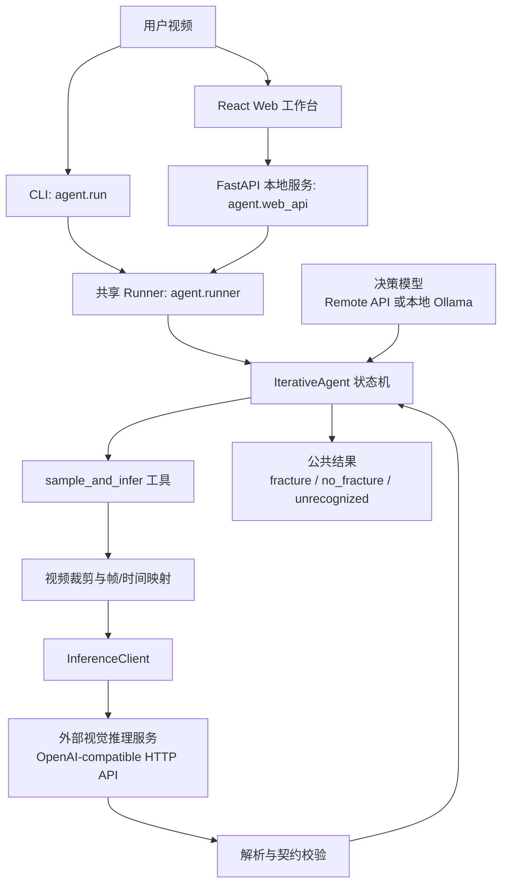

# 材料拉伸断裂识别 Agent 项目计划

> 状态：已批准
> 版本：10.0
> 适用范围：当前 TensileAgent 仓库，仅包含 Agent 端代码、配置、本地 Web 工作台和测试。

## 项目定位

TensileAgent 是材料拉伸试验视频的本地 Agent 分析系统。项目的核心目标是：对单个拉伸试验视频执行多轮区间检查，调用外部视觉模型判断局部片段，再由确定性状态机验证证据、收敛候选区间并输出 `fracture`、`no_fracture` 或 `unrecognized` 三种公共结论。

主要用户是项目研究人员、演示人员和本地评测使用者。系统优先保证契约清晰、失败显式、过程可追踪和本地可运行；不追求实时处理、远程多用户服务或训练侧闭环。

## 范围

本仓库包含：

1. `agent/`：Agent 状态机、Native Function Calling 工具契约、决策模型客户端、视觉推理 HTTP 客户端、视频裁剪与帧映射、CLI、Runner 和 FastAPI 后端。
2. `web/`：React、TypeScript、Vite 本地 Web 工作台，用于上传视频、配置决策模型、观察 SSE 事件、查看历史和导出结果。
3. `tests/`：围绕 Agent runtime、契约解析、采样、推理客户端、Runner、CLI 和 Web API 的项目级测试。
4. `docs/`：当前项目计划。旧的 project workflow 和分步骤 implementation 文档已移除，不再作为开发依据。
5. `data/08_runtime/`：Agent 运行时临时 clip、上传文件、历史记录和诊断信息的默认本地目录，必须保持 git ignored。

本仓库不包含：

1. 原始视频数据集治理、标签治理、数据划分或冻结测试清单生成。
2. 子视频生成、训练样本构建、模型微调、LLaMA-Factory submodule、checkpoint、模型权重或训练机脚本。
3. 视觉模型服务的部署实现。TensileAgent 只依赖其 HTTP API 和响应契约。
4. 在线标注、多用户账号权限、远程部署、数据库迁移、分布式队列或工业实时推理。
5. 多事件识别。当前每个视频最多输出一个主要断裂事件。

## 系统架构



职责边界：

| 模块                         | 职责                                                                      |
| -------------------------- | ----------------------------------------------------------------------- |
| `agent/schema.py`          | 定义模型输出、工具参数、单轮工具结果、最终输出和 Runner envelope 的 Pydantic 契约。                 |
| `agent/prompts.py`         | 维护视觉模型 system/user prompt 和 Meta-Agent 系统提示词。                           |
| `agent/llm.py`             | 统一远程 OpenAI-compatible 决策模型和本地 Ollama 决策模型的 Native Function Calling 接口。 |
| `agent/inference.py`       | 将临时 MP4 编码为 Base64 data URL，调用外部视觉模型服务，解析返回并抽取服务端预处理元数据。                |
| `agent/sampling.py`        | 使用 ffmpeg/ffprobe 裁剪视频片段并建立临时片段到原视频时间轴的映射。                              |
| `agent/iterative_agent.py` | 执行候选区间、覆盖检查、冲突处理、重复确认和终止规则。                                             |
| `agent/runner.py`          | 为 CLI 和 Web API 提供唯一共享执行内核。                                             |
| `agent/web_api.py`         | 提供本地任务队列、SSE 事件流、历史持久化、配置接口和静态前端托管。                                     |
| `web/`                     | 提供本地单用户操作界面，不实现 Agent 决策逻辑。                                             |

## 核心契约

视觉模型单轮输出必须是五字段 JSON：

```json
{
  "has_fracture": true,
  "fracture_between": [2, 3],
  "type": "韧性断裂",
  "location": "inside_gauge",
  "confidence": 0.92
}
```

字段规则：

| 字段                 | 规则                                                      |
| ------------------ | ------------------------------------------------------- |
| `has_fracture`     | `true` 表示存在断裂，`false` 表示确认未断裂，`null` 表示视频异常导致无法判断。      |
| `fracture_between` | 仅正常断裂时填写，必须是严格相邻帧 `[i, i+1]`，索引不能越过服务端实际选择的帧。           |
| `type`             | 闭集：七种正常断裂模式、`未断裂`、`未夹紧`、`视频异常`。                         |
| `location`         | 正常断裂时为 `inside_gauge` 或 `outside_gauge`；其他情况必须为 `null`。 |
| `confidence`       | `0.0` 到 `1.0` 的有限数字，不能是字符串或布尔值。                         |

七种正常断裂模式为：`韧性断裂`、`脆性断裂`、`界面脱粘`、`齐根断裂`、`爆炸性断裂`、`半脆半韧断裂`、`界面脱粘、齐根断裂`。

三层结果边界：

| 层次         | 输出                     | 责任                          |
| ---------- | ---------------------- | --------------------------- |
| 视觉模型输出     | `ModelOutput`          | 只描述当前视频片段，不给出 Agent 最终结论。   |
| 工具结果       | `SampleAndInferResult` | 校验字段、类别、置信度、相邻索引、媒体边界和时间映射。 |
| Agent 最终结果 | `FinalOutput`          | 依据全部历史和程序门槛输出公共三状态结论。       |

## Agent 决策规则

Agent 使用 Native Function Calling，只暴露两个工具：

1. `sample_and_infer`：输入 `sample_range` 和完整 user prompt；源视频由 Runner 上下文绑定，工具内部完成裁剪、编码、HTTP 推理、解析和时间映射。
2. `terminate`：由决策模型提出最终状态、语义字段和证据轮次；程序层再次校验，不直接信任模型结论。

程序必须强制执行：

1. 首轮检查完整视频区间。
2. 每轮 `sample_and_infer` 后，将更新后的候选区间、覆盖状态和历史追加到下一轮 Meta-Agent user context。
3. 输出 `fracture` 前，至少两轮正常断裂证据具有非空共同交集，且最终时间区间宽度不超过 `tolerance_seconds`，默认 1 秒。
4. 输出 `no_fracture` 前，必须完成五个覆盖全视频且相邻重叠的区间检查；覆盖完成前不得把局部未断裂当成全局未断裂。
5. `未夹紧`、`视频异常`、非法 JSON、契约校验失败、低置信度、证据冲突、基础设施连续失败或达到最大轮次时，必须显式进入复查、失败 envelope 或 `unrecognized`，不能伪装为确定断裂/未断裂。
6. 最终公共状态只有 `fracture`、`no_fracture`、`unrecognized`。

## 运行形态

### CLI

CLI 通过 `python3 -m agent.run` 调用共享 Runner，支持单视频、目录批量、输入列表、mock 模式、决策模型后端切换、模型覆盖、结果输出和自定义工作目录。

### 本地 Web 工作台

Web 工作台由 FastAPI 后端和 React 前端组成：

1. 后端负责上传文件保存、任务创建、单 worker 顺序调度、Runner 事件转发、历史 JSON 持久化和静态前端托管。
2. 前端负责本地配置向导、任务提交、队列状态、实时事件、结果查看、历史回看和导出。
3. SSE 只传递必要过程事件；API 和持久化结果不得泄露 Base64 视频、API key、token 或不必要的内部临时路径。
4. 展示模式下由 FastAPI 托管 `web/dist`；开发模式下 Vite dev server 代理 `/api` 到后端。

## 配置与外部依赖

运行时配置集中在 `agent/config.yaml` 和 `agent/.env`：

1. 决策模型可使用远程 OpenAI-compatible API 或本地 Ollama。
2. 视觉推理服务通过 `backend.api_url` 和 `backend.model` 配置，必须兼容 OpenAI chat completions 请求格式并支持 Base64 `data:video/mp4` 输入。
3. API key 只能放在本地 `.env` 或环境变量中，不提交到仓库。
4. ffmpeg/ffprobe 是视频裁剪和元数据读取的首选工具；缺失时只能使用代码支持的降级路径。
5. `data/08_runtime/` 下的上传、clip、诊断和历史文件均为本地运行产物，不提交。

外部视觉服务必须返回可解析的五字段 JSON。若服务端能返回实际预处理帧表和处理器信息，Agent 使用该元数据完成严格时间映射；缺失必要元数据时，Agent 应 fail closed，而不是猜测帧索引含义。

## 开发与验证

常用命令：

```bash
uv sync --dev
python3 -m pytest tests -q
git diff --check
```

Agent runtime 相关变更应优先覆盖：

1. `tests/test_schema.py`
2. `tests/test_parser.py`
3. `tests/test_inference.py`
4. `tests/test_sampling*.py`
5. `tests/test_iterative_agent.py`
6. `tests/test_runner.py`
7. `tests/test_run_cli.py`

Web/API 相关变更应覆盖对应 FastAPI、配置和前端构建验证。前端变更需至少运行 `npm run build`；涉及交互体验时应本地启动后端并在浏览器验证关键路径。

## 验收标准

1. CLI 和本地 Web 工作台都通过同一个 `agent.runner` 执行分析，不出现两套 Agent 决策逻辑。
2. 视觉模型输出、工具结果、最终结果均通过 Pydantic 契约校验；非法字段、非法组合、越界索引和非相邻 `fracture_between` 被拒绝。
3. `fracture`、`no_fracture`、`unrecognized` 三种状态均由代码层门槛保证，不依赖决策模型自觉遵守。
4. 每轮历史、候选区间、采样区间、置信度、解析错误和失败原因可追踪；公共结果与内部诊断分层保存。
5. API、日志和持久化文件不泄露 Base64 视频、API key、token 或不必要的临时绝对路径。
6. Mock 模式可用于无外部视觉服务时的本地回归；真实模式可连接外部 OpenAI-compatible 视觉服务。
7. `python3 -m pytest tests -q` 和 `git diff --check` 在当前仓库职责范围内通过。

## 文档治理

`docs/PROJECT_PLAN.md` 是当前仓库唯一项目级设计文档。旧的 `docs/PROJECT_WORKFLOW.md` 和 `docs/IMPLEMENTATIONS/` 已不再维护；后续新增文档必须服务于 Agent 端运行、接口、配置、评测或运维，不得把训练流水线重新纳入本仓库职责。

当目标、公共契约、核心状态机规则、运行入口或外部服务边界变化时，先更新本文，再实施代码变更。

## 风险与待确认事项

1. 外部视觉服务的实际预处理元数据可能缺失或与约定不一致：Agent 必须显式失败或进入 `unrecognized`，不能猜测时间映射。
2. 决策模型的 function calling 能力和稳定性因后端而异：所有关键门槛必须保留在代码层。
3. 多轮分析耗时受视频长度、裁剪速度、模型服务延迟和最大轮次影响：需要在运行记录中保留轮次、耗时和失败原因。
4. 当前测试目录仍可能包含历史训练流水线迁移遗留项；后续应按“Agent-only”边界继续清理测试和 README。

