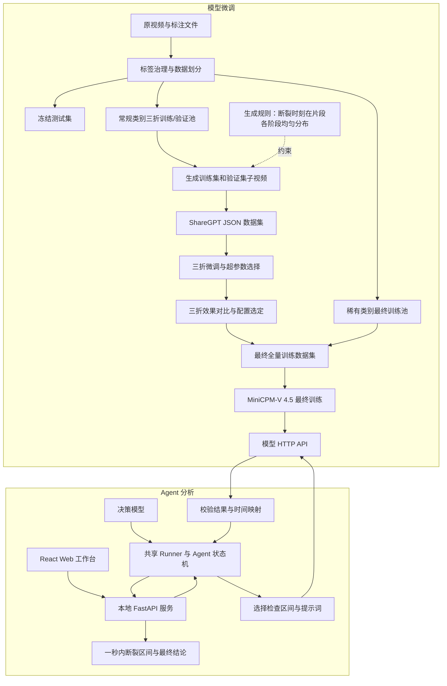

# 材料拉伸断裂识别 Agent 项目计划

> 状态：已批准
> 版本：9.0

## 项目目标

面向 Agent 竞赛和材料拉伸视频研究，建设一套可复现、可追踪的断裂识别系统：MiniCPM-V 4.5 判断视频片段，通用大模型 Agent 多轮检查并缩小断裂区间，最终输出可靠结论或明确表示无法辨认。

主要用户是竞赛评委和项目研究人员。项目优先保证过程可解释、结果可复现和方案可公平比较，不追求实时推理、工业部署或多人在线服务。

本文是项目设计与开发工作流的唯一权威来源，项目级变更必须修订并重新批准本文。

## 需求与范围

MVP 包含：

1. 数据集：可复现的数据治理、视频级划分和训练样本构建。
2. 模型微调：MiniCPM-V 4.5 interval 微调、独立推理服务和单次判断。
3. Agent：多轮 Agent、单视频与批量 Runner、CLI 和本地单用户 Web 工作台。
4. 效果评估：在同一冻结测试清单上分别评估微调模型和完整 Agent。

MVP 不包含多事件识别、新数据采标、在线标注、实时推理、工业部署、多用户服务、账号权限、远程部署、多基础模型适配；自适应抽帧可作为后续优化。

- 模型单轮输出 `has_fracture`、`fracture_between`、`type`、`location`、`confidence`。
- 正常断裂的 `fracture_between` 只接受实际采样帧中的严格相邻索引 `[i,i+1]`；未断裂、未夹紧和视频异常不得携带区间或位置。

 

Agent 最终状态只有：

- `fracture`：可靠确认断裂。输出：宽度不超过 1 秒的断裂时间区间、断裂模式、断裂位置和置信度。
- `no_fracture`：完成规定的覆盖检查后确认未断裂。
- `unrecognized`：异常、冲突、非法输出、置信度不足或达到检查上限，不能伪装成前两类。

每个视频只定位一个主要断裂事件。

## 技术方案

### 架构与职责

**模型微调**

1. **数据划分**：按原视频划分训练集、验证集和冻结测试集；稀有类别只进入最终训练池。
2. **子视频生成**：仅处理训练集和验证集；生成规则是让断裂时刻均匀分布在片段前、中、后等阶段。
3. **数据集构建**：生成适用于 MiniCPM-V 4.5 的 LLaMA-Factory ShareGPT 多模态 JSON。
4. **三折选型**：完成三折微调、超参数调整和效果对比，确定最终配置。
5. **全量训练与部署**：合并训练集、验证集和稀有类别训练池；冻结测试集不参与训练。最终模型部署为 HTTP API。

> 注：MVP 阶段仅以 MiniCPM-V 4.5 跑通训练与 Agent 链路；MVP 完成后将逐步接入其他多模态基座模型，并在相同数据划分、接口契约和评估清单下训练对比。

**Agent 分析**

1. **交互入口**：用户通过本地单用户 Web 工作台上传视频，本地 API 调用共享 Runner 启动 Agent 状态机。
2. **迭代分析**：决策模型选择检查区间和提示词，反复调用微调模型 API；程序校验输出并完成时间映射。
3. **最终决策**：断裂路径将候选范围收紧至 1 秒以内，并聚合模式、位置和置信度；达到相应门槛后输出 `fracture` 或 `no_fracture`，否则输出 `unrecognized`。

### 模型、工具与 Agent 契约

三层契约相互独立：

| 层次       | 职责                                    |
| -------- | ------------------------------------- |
| 模型输出     | 描述当前片段的五字段 JSON，不给出 Agent 最终结论        |
| 工具结果     | 校验字段、类别、置信度、相邻索引和视频边界，并根据实际采样映射生成时间区间 |
| Agent 结果 | 执行覆盖、重复确认、冲突和终止规则，输出三种最终状态            |

- 正常断裂模式闭集为：`韧性断裂`、`脆性断裂`、`界面脱粘`、`齐根断裂`、`爆炸性断裂`、`半脆半韧断裂`、`界面脱粘、齐根断裂`。
- 确认断裂的位置为 `inside_gauge`、`outside_gauge` 或最终聚合后的 `unknown`。

视觉模型部署为独立的 OpenAI-compatible HTTP 服务。Agent 通过统一 `InferenceClient` 发送 Base64 视频，不直接加载权重，也不依赖共享文件系统。模型、LoRA、处理器、配置和实际抽帧元数据进入运行记录。

Agent 使用 Native Function Calling，不引入 MCP。本地决策模型和远程 API 共用工具契约、上下文、状态机和最终输出，通过配置切换。每轮把更新后的候选范围和历史带入下一轮上下文；所有非法输出都显式失败，不猜测修复。

程序强制执行以下门槛：

- 首轮检查完整视频。
- 输出 `fracture` 前，至少两次局部断裂证据具有非空共同交集，且交集宽度不超过 1 秒。
- 首轮为未断裂时，按固定顺序检查五个覆盖全视频、相邻重叠 25% 的区间；五轮均为合法且达到置信度要求的未断裂，才输出 `no_fracture`。
- 未夹紧或视频异常在同一区间复查；持续冲突、解析失败、低置信度或达到检查上限时输出 `unrecognized`。

### Web 工作台

Web 工作台采用 React、TypeScript、Vite、Tailwind CSS 和 lucide-react 构建，源码位于 `web/`。前端只负责视频上传、任务队列、实时事件展示、历史回看、配置摘要和结果导出，不实现 Agent 决策逻辑。

本地 API 采用 FastAPI 和 Uvicorn，封装 `agent/runner.py` 并复用同一 Runner 契约。API 负责保存上传文件、创建任务、顺序调度运行、转发 runner 事件、持久化公共结果和导出文件。实时事件使用 SSE 单向事件流；任务历史使用本地 JSON 文件持久化到 ignored runtime 目录。MVP 采用单 worker 顺序队列，同一时间只运行一个分析任务，前端可以展示多个排队任务。

开发模式下，前端 Vite dev server 与本地 FastAPI 服务双进程运行，Vite 代理 `/api` 到后端。展示模式下，前端构建为 `web/dist`，由 FastAPI 托管静态产物，用户只需启动本地 API 服务并在浏览器打开本地地址。

### 运行与工作流

- 开发机：MacBook Air M4、Python 3.11、uv 和 Node.js；负责全部代码、配置、数据 pipeline、Agent 调试、Web 工作台和单元测试。
- 训练机：远程 GPU 环境、pip；只拉取已提交代码，执行训练、推理验证和结果导出，不直接修改项目代码。
- 两机通过 Git 同步；`main` 是稳定集成分支，并行任务优先使用 worktree。Submodule 指针由项目仓库统一记录，两机同步后执行 submodule 更新。
- 原始视频、本地生成数据、运行时片段、模型权重、checkpoint、验证结果、密钥和 token 不提交。需要归档的训练产物通过 Git 之外的方式传输，并记录版本与配置。

共享 Runner 是 CLI 和本地 Web 工作台的唯一执行内核。普通分析界面不读取真值；评估模式在推理完成后展示标注和统一指标。公共结果与内部诊断分层保存，默认只把公共结果作为最终结论。Web API 和前端不得返回完整 Base64、API key、token 或不必要的内部临时路径。

### 评估

**微调模型评估**

- 三折验证用于比较模型效果、调整超参数并确定最终训练配置。
- 最终模型在冻结测试集上进行单次推理，评估输出合法率、断裂识别、时间区间、断裂模式和位置。

**Agent 整体效果评估**

- Agent 使用同一冻结测试集，评估最终状态、时间区间覆盖与宽度、断裂模式、位置和 `unrecognized` 比例。
- 同时记录检查轮数、运行耗时和失败原因，并与微调模型的单次推理结果比较，验证多轮分析的实际收益。

模型选择和调参只使用训练集与验证集；冻结测试集仅用于最终评估。

## 实施规划

1. **完成数据划分**：治理标签，建立冻结测试集、常规类别三折训练/验证池和稀有类别最终训练池。
2. **完成训练数据构建**：按断裂时刻分布规则生成训练/验证子视频，并构建 ShareGPT 多模态 JSON。
3. **完成三折选型**：执行三折微调和超参数调整，比较效果并确定最终配置。
4. **完成最终模型服务**：构建全量训练数据集，完成 MiniCPM-V 4.5 最终训练并部署 HTTP API。
5. **完成 Agent 分析链路**：实现本地 Web 工作台、本地 API、共享 Runner、决策循环、模型 API 调用和程序级终止门槛。
6. **完成效果评估**：分别评估微调模型的单次推理效果和 Agent 的整体效果，并生成可复现报告。

步骤按顺序推进；每一步必须有独立、已批准且绑定项目计划版本 9.0 的实施方案。

## 验收标准

- 数据准备、训练、服务、Agent 和评估可由固定配置重复执行，并记录代码、配置、模型和数据清单版本。
- 数据按原视频隔离；冻结测试集不参与训练、选择或调参；普通推理不读取真值。
- 训练与推理使用相同的真实视频处理器语义，最多 8 帧且实际映射可追踪；不一致时中止。
- 模型五字段输出通过闭集、条件字段、置信度、严格相邻索引和媒体边界校验。
- `fracture`、`no_fracture`、`unrecognized` 均满足程序级门槛，本地和远程决策后端使用相同契约。
- CLI 与本地 Web 工作台复用共享 Runner，支持单视频、批量、任务队列、SSE 过程展示、历史回看和结果导出；公共结果不混入帧区间等内部诊断。
- 微调模型评估报告覆盖输出合法率、断裂识别、时间区间、模式和位置；Agent 评估报告覆盖最终状态、`unrecognized`、检查轮数、耗时和失败原因。
- 断裂/未断裂平均正确率达到 80%；全部真实断裂中至少 60% 的输出区间覆盖真实时刻且宽度不超过 1 秒，并单报不超过 0.5 秒的成功率。
- 有独立评估视频的常见断裂模式综合得分达到 0.75；真实位置明确的视频位置准确率达到 70%，`unknown` 按未命中计算。
- 完整 Agent 的时间定位效果优于微调模型的单次推理结果。

## 风险与待确认事项

- [非阻塞] 数据量小且类别不均衡：使用视频级隔离、逐类指标和稀有类别案例展示。
- [非阻塞] 处理器参数可能未实际生效：训练和服务启动前以真实预处理结果核验，无法取得帧映射时停止定位。
- [非阻塞] 模型置信度可能未校准：同时报告置信度分布、实际正确率和 `unrecognized` 比例。
- [非阻塞] 双后端能力和成本不同：分别测试并报告，不降低程序级门槛。
- [非阻塞] 多轮检查增加耗时：记录每个视频的检查次数、耗时和失败原因。
- [非阻塞] 完整前端引入 Node.js、前端构建和本地 API：通过本地单用户边界、单 worker 队列和 FastAPI 静态托管控制复杂度，不在 MVP 中引入账号、多用户或远程部署。
- [非阻塞] 当前代码和训练配置仍绑定 MiniCPM-V 4.5，项目目标为 MiniCPM-V 4.5：代码后续将适配 4.5 的模型路径、模板、处理器和训练配置；版本 9.0 批准后先修订对应实施方案，再迁移并验证。
